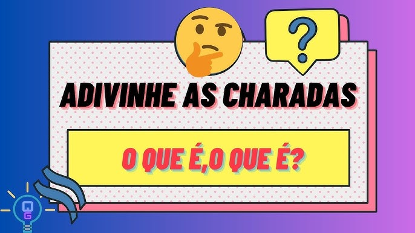

## Status  
Projeto concluído!  

# Charadas do Dia 🎉🧠  

  

## Descrição  
O projeto "Charadas do Dia" é uma aplicação web interativa que traz uma nova charada a cada clique! O objetivo é desafiar o usuário com enigmas divertidos, permitindo que ele tente responder e veja se acertou ou não. Um jogo leve, educativo e descontraído! Ideal para passar o tempo treinando o raciocínio lógico.  

# Índice  
* [Status](#status)  
* [Funcionalidades](#funcionalidades)  
* [Tecnologias Utilizadas](#tecnologias-utilizadas)
* [Pré-Requisitos](#pré-requisitos)
* [Autores](#autores)  
* [Vercel](#vercel)  
* [Licença](#licença)  

## Funcionalidades  
- ✅ Mostra uma charada aleatória vinda da API  
- ✅ Permite o usuário digitar uma resposta  
- ✅ Validação da resposta com acentuação e símbolos ignorados  
- ✅ Exibe se a resposta está correta ou incorreta
- ✅ Botão para gerar uma nova charada  
- ✅ Interface com visual lúdico, colorido e divertido  

## Tecnologias Utilizadas  
**Linguagens/Frameworks:**  
-   
-   
-   
-   
-   
-   
-   

## Pré-Requisitos  
Antes de rodar o projeto, é necessário:  
- Ter o Python 3.x instalado  
- Ter o Pip (gerenciador de pacotes Python)  
- Ter o Git instalado (opcional para clonar o repositório)  

## Autores
- Yasmim Bueno de Morais - [GitHub](https://github.com/YMorais/) - yasmim.morais.senai@gmail.com

## Vercel
- Yasmim Bueno de Morais - [Vercel](https://front-end-charadas.vercel.app/) - yasmim.morais.senai@gmail.com

## Licença  
Este projeto está licenciado sob a Licença MIT - veja o arquivo [LICENSE](LICENSE) para mais detalhes.